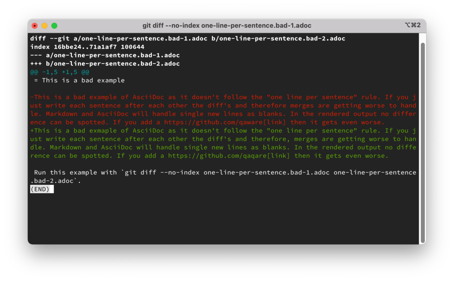
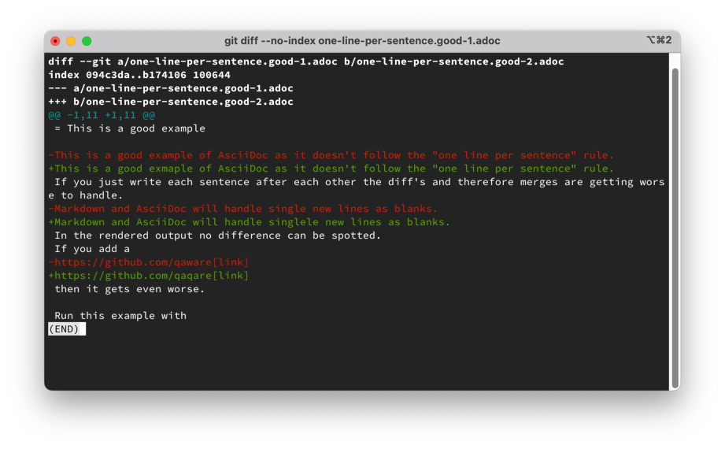

= One Line per Sentence Principle

When writing any kind of markup-language which is versioned via `git` the *One Line per Sentence* principle helps to make the markup text easier readable and avoids conflicts in `git`.
The principle defines as: Each new sentence starts in a new line.
We also suggest to put inline links on new lines which helps to read the markup faster when editing.

The principle also called
https://rhodesmill.org/brandon/2012/one-sentence-per-line/["Semantic Linefeeds"]
by Brandon Rhodes is mentioned as best practices at several points.
AsciiDoc itself is
https://asciidoctor.org/docs/asciidoc-recommended-practices/#one-sentence-per-line[promoting]
the principle.
Nick Groenen summarized it ins his
https://nick.groenen.me/notes/one-sentence-per-line/[blogpost]
to have the following advantages.

[quote,Nick Groenen]
____
* It prevents reflows (meaning a change early in the paragraph won’t cause the remaining lines in the paragraph to reposition), which ensures code diffs look more clean.
* It lets you swap sentences more easily.
* It lets you separate and join paragraphs more easily.
* It lets you comment out sentences or add commentary to them.
* You can spot sentences which are too long or sentences that vary widely in length.
* You can spot redundant (and thus mundane) patterns in your writing.
* You can easily apply bulk actions on sentences with editor macros, such as converting to list items by prepending a dash to each line.
* It improves using GitHub’s “suggest changes” workflow, as it lets your reviewer start a new suggestion for each sentence instead of having to combine them.
____

== Examples

Can you spot the difference in the diffs?

To test it yourself run:

[source,bash]
----
# Bad example
git diff --no-index one-line-per-sentence.bad-1.adoc one-line-per-sentence.bad-2.adoc

# Good example
git diff --no-index one-line-per-sentence.good-1.adoc one-line-per-sentence.good-2.adoc
----

.Not following the principle

.Following the principle

